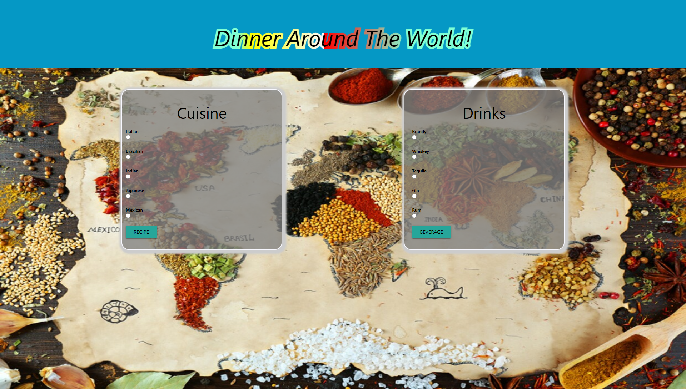

# Dinner-Around-the-World 🌍
Create a simple web page that allows users to select different recipes to choose from for valentines day. This app will run in the browser and feature updated HTML and CSS powered by Jquery.

### Live Application Link & GitHub Repo 👓

[Link to website](https://adambowers09.github.io/dinner-around-the-world/)

[Link to Github Repo](https://github.com/adambowers09/dinner-around-the-world)

## Built With 🔨 🧰
#### Technology
- HTML
- CSS
- jQuery
- AJAX
- APIs
* [Cocktail API](https://www.thecocktaildb.com/api.php)
* [Recipe API](https://developer.edamam.com/edamam-recipe-api)

#### Tasks and roles:
- Front-End: Adam, Tony, Abi & Deandria
- Back-End: Adam, Tony & Abi 
- README: Adam & Deandria
- Presentation: The entire team!! 😎
#### Challenges: 
  - Deciding on what topic to choose from and API's
  - Getting API's to work
  - Javascript
  - Collaborating as a group
  - Lighthoue report / accessibility

#### Successes:
- Developing working application 
- Working with API's
- Overcoming Git merge/conflicts
- Utilizing Materialize

## Directions for the Future
- Create a link to view a video of each recipe.
- Create a tool to locate local restaurants by inputting your zipcode. 
- Create a poll of how good each recipe is.
- Have local storage on the page so that users can bookmark their favorite recipes.  

## Screenshot

